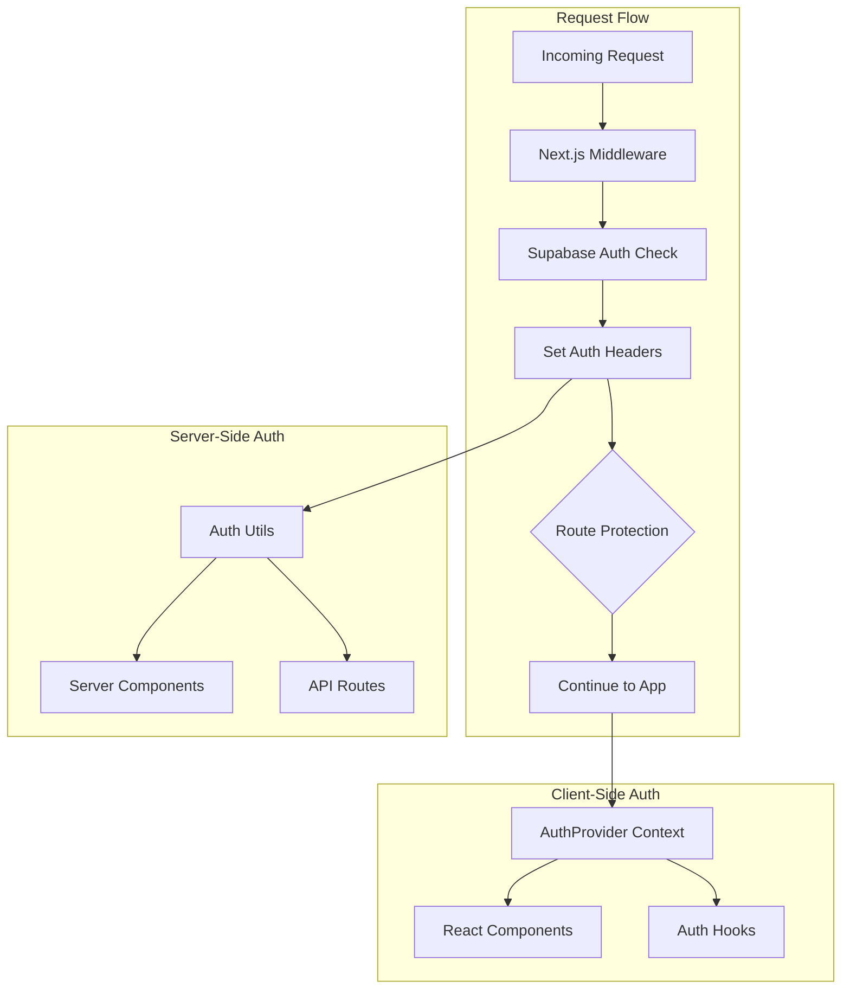
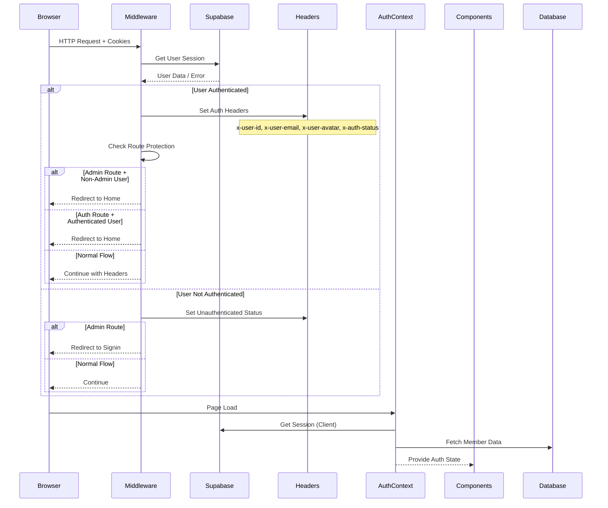
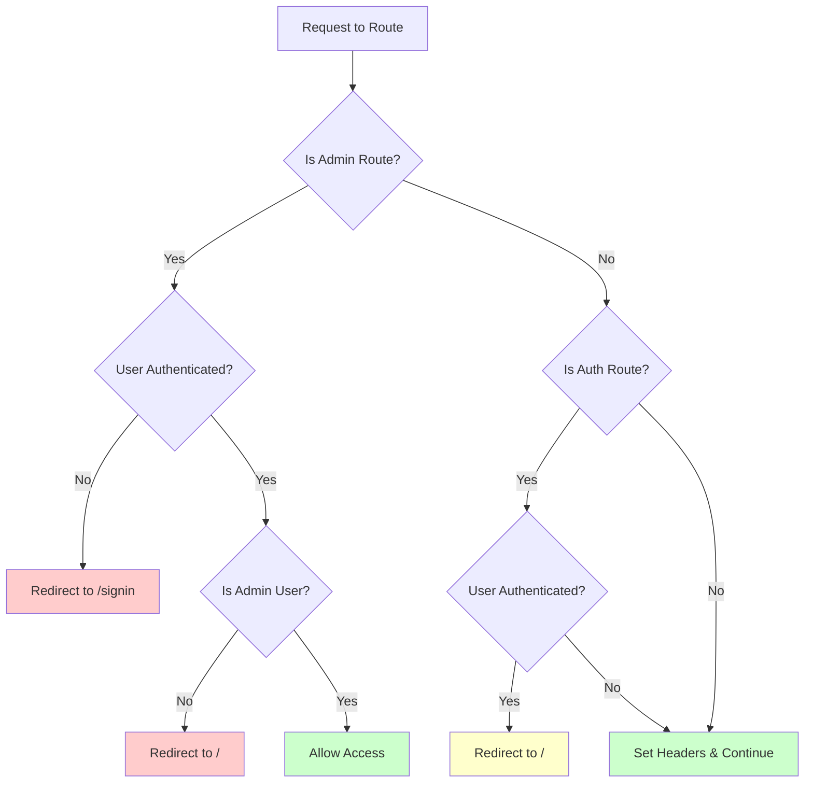
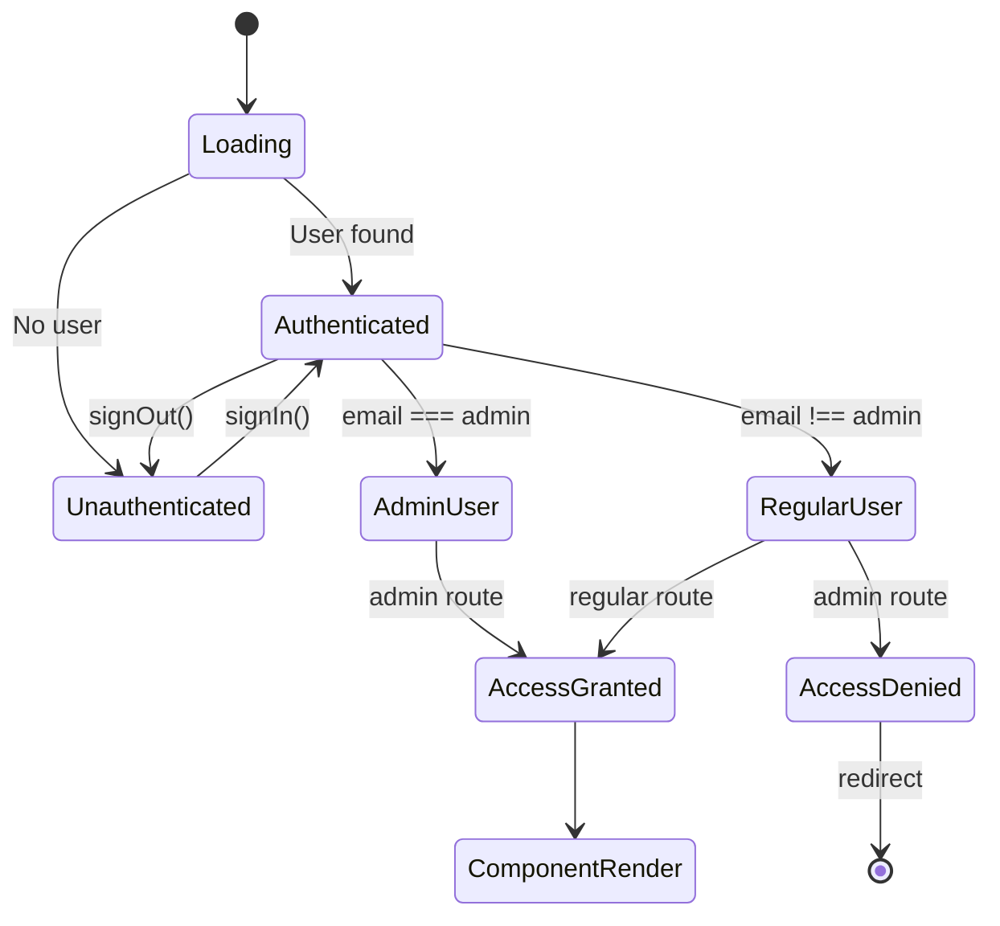

# 🔐 Authentication & Middleware System

Complete guide to the unified authentication system with visual flow charts and practical examples.

## 🏗️ System Architecture



## 🔄 Complete Data Flow



## 📁 File Structure

```
src/lib/auth/
├── index.ts           # Main exports
├── middleware.ts      # Auth middleware logic  
├── client.ts          # Browser Supabase client
├── server.ts          # Server Supabase client
├── utils.ts           # Server-side utilities
└── context.tsx        # React context & hooks

src/middleware.ts      # Next.js middleware entry
src/app/api/auth/
└── member/route.ts    # Member data API
```

## 🛡️ Route Protection Flow



## 🔧 Available Utilities

### Server-Side Utilities (Server Components & API Routes)

#### Basic Auth Data
```typescript
import { 
  getUserFromHeaders, 
  getMemberFromHeaders, 
  getAuthData,
  isAuthenticated,
  isAdmin 
} from '@/src/lib/auth';

// Get user from headers
const user = await getUserFromHeaders();
// Returns: { id: string, email: string, avatar?: string } | null

// Get member from database  
const member = await getMemberFromHeaders();
// Returns: Member | null

// Get complete auth data
const { user, member, isAuthenticated, isAdmin } = await getAuthData();

// Quick checks
const authed = await isAuthenticated(); // boolean
const admin = await isAdmin(); // boolean
```

#### Quick Access Functions
```typescript
import { 
  getUserId, 
  getUserEmail, 
  getMemberId,
  requireAuth,
  requireAdmin 
} from '@/src/lib/auth';

// Get specific values
const userId = await getUserId(); // string | null
const email = await getUserEmail(); // string | null  
const memberId = await getMemberId(); // string | null

// Require auth (throws if not authenticated)
const user = await requireAuth(); // AuthUser (throws if null)

// Require admin (throws if not admin)
const adminUser = await requireAdmin(); // AuthUser (throws if not admin)
```

#### Advanced Database Queries
```typescript
import { getMemberWithRelations } from '@/src/lib/auth';

// Get member with specific relations
const memberWithTours = await getMemberWithRelations({
  tourCards: true,
  teams: true,
});
```

### Client-Side Hooks (React Components)

#### Main Auth Hook
```typescript
import { useAuth } from '@/src/lib/auth';

function MyComponent() {
  const { 
    user,           // Supabase User object
    member,         // Database Member object  
    isAuthenticated, // boolean
    isAdmin,        // boolean
    isLoading,      // boolean
    signOut,        // () => Promise<void>
    refreshAuth     // () => Promise<void>
  } = useAuth();
  
  if (isLoading) return <Loading />;
  if (!isAuthenticated) return <SignIn />;
  
  return <Dashboard user={user} member={member} />;
}
```

#### Specific Hooks
```typescript
import { 
  useUser, 
  useMember, 
  useIsAuthenticated, 
  useIsAdmin 
} from '@/src/lib/auth';

function ProfileComponent() {
  const user = useUser(); // User | null
  const member = useMember(); // Member | null
  const isAuth = useIsAuthenticated(); // boolean
  const isAdminUser = useIsAdmin(); // boolean
  
  return (
    <div>
      <h1>{user?.email}</h1>
      {isAdminUser && <AdminPanel />}
    </div>
  );
}
```

## 🎯 Practical Usage Examples

### 1. Server Component with Auth
```typescript
// app/dashboard/page.tsx
import { getAuthData, requireAuth } from '@/src/lib/auth';

export default async function DashboardPage() {
  // Option 1: Handle unauthenticated gracefully
  const { user, member, isAuthenticated } = await getAuthData();
  
  if (!isAuthenticated) {
    return <div>Please sign in to access dashboard</div>;
  }
  
  // Option 2: Require auth (throws if not authenticated)
  // const user = await requireAuth();
  
  return (
    <div>
      <h1>Welcome {user.email}</h1>
      <p>Member since: {member?.createdAt}</p>
    </div>
  );
}
```

### 2. Admin-Only Server Component
```typescript
// app/admin/page.tsx  
import { requireAdmin } from '@/src/lib/auth';

export default async function AdminPage() {
  // Throws if not admin - will be caught by error boundary
  const user = await requireAdmin();
  
  return (
    <div>
      <h1>Admin Dashboard</h1>
      <p>Welcome, {user.email}</p>
    </div>
  );
}
```

### 3. API Route with Auth
```typescript
// app/api/user-data/route.ts
import { getUserId, isAuthenticated } from '@/src/lib/auth';
import { NextRequest } from 'next/server';

export async function GET(request: NextRequest) {
  const isAuth = await isAuthenticated();
  
  if (!isAuth) {
    return Response.json({ error: 'Unauthorized' }, { status: 401 });
  }
  
  const userId = await getUserId();
  const userData = await getUserData(userId);
  
  return Response.json({ data: userData });
}
```

### 4. Client Component with Auth Context
```typescript
// components/UserProfile.tsx
'use client';

import { useAuth } from '@/src/lib/auth';

export default function UserProfile() {
  const { user, member, isLoading, signOut, isAuthenticated } = useAuth();
  
  if (isLoading) {
    return <div>Loading...</div>;
  }
  
  if (!isAuthenticated) {
    return <div>Please sign in</div>;
  }
  
  return (
    <div>
      <h2>{user?.email}</h2>
      <p>Member: {member?.firstname} {member?.lastname}</p>
      <button onClick={signOut}>Sign Out</button>
    </div>
  );
}
```

### 5. Conditional Admin Content
```typescript
// components/AdminPanel.tsx
'use client';

import { useIsAdmin } from '@/src/lib/auth';

export default function ConditionalAdminPanel() {
  const isAdmin = useIsAdmin();
  
  if (!isAdmin) {
    return null; // or <div>Access denied</div>
  }
  
  return (
    <div>
      <h3>Admin Controls</h3>
      <button>Manage Users</button>
      <button>View Analytics</button>
    </div>
  );
}
```

## 🚀 Setup Instructions

### 1. Wrap Your App
```typescript
// app/layout.tsx
import { AuthProvider } from '@/src/lib/auth';

export default function RootLayout({ children }) {
  return (
    <html>
      <body>
        <AuthProvider>
          {children}
        </AuthProvider>
      </body>
    </html>
  );
}
```

### 2. Environment Variables
```bash
# .env.local
NEXT_PUBLIC_SUPABASE_URL=your_supabase_url
NEXT_PUBLIC_SUPABASE_ANON_KEY=your_supabase_anon_key
```

### 3. Database Setup
Ensure your Member table has these fields:
```sql
CREATE TABLE "Member" (
  id TEXT PRIMARY KEY,
  email TEXT UNIQUE NOT NULL,
  firstname TEXT,
  lastname TEXT,
  -- other fields...
);
```

## 📊 Auth State Management



## 🔍 Debugging & Troubleshooting

### Check Auth Headers
```typescript
// In any server component
import { headers } from 'next/headers';

const headersList = headers();
console.log('Auth Headers:', {
  userId: headersList.get('x-user-id'),
  userEmail: headersList.get('x-user-email'),
  authStatus: headersList.get('x-auth-status'),
});
```

### Inspect Auth State (Client)
```typescript
// In any client component
import { useAuth } from '@/src/lib/auth';

function DebugAuth() {
  const auth = useAuth();
  
  return (
    <pre>
      {JSON.stringify(auth, null, 2)}
    </pre>
  );
}
```

### Common Issues

1. **Headers not available**: Make sure middleware is running on the route
2. **Member data null**: Check database connection and Member table structure  
3. **Auth context undefined**: Ensure AuthProvider wraps your components
4. **Redirect loops**: Check route protection logic in middleware

## 🎨 Integration Patterns

### Server + Client Sync
```typescript
// Server Component
import { getAuthData } from '@/src/lib/auth';

export default async function HybridPage() {
  const { isAuthenticated } = await getAuthData();
  
  return (
    <div>
      <ServerContent authenticated={isAuthenticated} />
      <ClientContent />
    </div>
  );
}

// Client Component  
'use client';
import { useIsAuthenticated } from '@/src/lib/auth';

function ClientContent() {
  const isAuthenticated = useIsAuthenticated();
  // This will match server-side state after hydration
  
  return <div>Client auth: {isAuthenticated}</div>;
}
```

This system provides seamless authentication across your entire Next.js application with minimal configuration and maximum flexibility! 🚀
