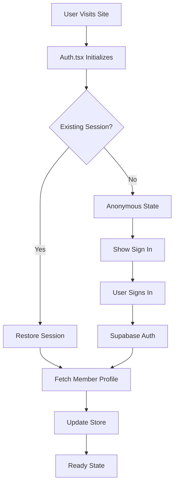

# Authentication Module

This module handles all authentication and authorization functionality for the PGC Tour application.

## 📁 Files Overview

### `Auth.tsx` ✅ **ACTIVE**

**Main authentication provider and React context - Updated for New Store System**

**Purpose:**

- Provides authentication state and methods to the entire application
- Integrates with Supabase authentication
- Manages member profile data
- Synchronizes auth state with the new user store from `domains/user/store.ts`

**Key Features:**

- Session persistence and restoration
- Member profile integration
- Error handling and loading states
- Automatic session refresh
- **NEW**: Uses domain-based user store instead of deprecated main store

**Usage:**

```tsx
import { useAuth } from "@/src/lib/auth/Auth";

function MyComponent() {
  const {
    user, // Supabase User object
    session, // Supabase Session object
    member, // PGC Tour Member profile
    isAuthenticated, // Boolean auth status
    isLoading, // Loading state
    error, // Error state
    signOut, // Sign out function
    refreshAuth, // Manual refresh function
  } = useAuth();

  // Component logic here
}
```

**Provider Setup:** Already configured in `app/layout.tsx`

**Store Integration:**

- Uses `useUserStore` from `@/src/lib/store/domains/user/store`
- Replaces deprecated `useMainStore` integration
- Provides backward-compatible `authUtils` for external use

### `AuthContext.tsx` ⚠️ **DEPRECATED**

**Legacy authentication context - DO NOT USE**

This file is kept for reference but should not be used in new code. All functionality has been migrated to `Auth.tsx`.

### `AuthStoreService.ts` ✅ **UPDATED**

**Service layer for auth-store integration - Updated for New Store System**

**Purpose:**

- Provides utility functions for auth-related store operations with the new user store
- Handles data transformation between auth and store states
- Manages authentication-related side effects
- **NEW**: Uses domain-based user store instead of deprecated main store

**Key Functions:**

- Member profile synchronization with `useUserStore`
- Auth state persistence using new store methods
- Store cleanup on sign out with `userStore.reset()`

**Migration Notes:**

- All `useMainStore` references have been replaced with `useUserStore`
- Uses `userStore.setCurrentMember()` instead of `setAuthState()`
- Simplified API that leverages the user domain store's built-in auth methods

## 🔧 Integration Points

### With New User Store

The auth module integrates directly with the new domain-based user store (`useUserStore`) to:

- Update member information using `setCurrentMember()`
- Set authentication status with `setAuthenticated()`
- Clear all user data on sign out with `reset()`
- Maintain user preferences and tour card associations

### With Supabase

- Uses Supabase client for authentication operations
- Handles session management and persistence
- Integrates with Supabase middleware for protected routes

**Migration from Main Store:**

- Replaced `useMainStore.getState().setAuthState()` with `useUserStore` methods
- Uses domain-specific user store instead of monolithic main store
- Maintains backward compatibility through `authUtils` export

## 🔄 Authentication Flow



## 🛡️ Security Considerations

- All authentication operations use Supabase's secure authentication
- Session tokens are handled securely by Supabase
- Member data is only accessible when authenticated
- Automatic session refresh prevents token expiration issues

## 📋 Migration Notes

### Store System Migration (June 2025)

The auth system has been updated to work with the new domain-based store architecture:

**Old way (deprecated):**

```tsx
// ❌ Old way - used main store
import { useMainStore } from "@/src/lib/store/store";
const store = useMainStore.getState();
store.setAuthState(member, true);
```

**New way (current):**

```tsx
// ✅ New way - uses domain user store
import { useUserStore } from "@/src/lib/store/domains/user/store";
const userStore = useUserStore.getState();
userStore.setCurrentMember(member);
userStore.setAuthenticated(true);
```

### Auth Context Migration

If you encounter imports from `AuthContext.tsx`, update them to use `Auth.tsx`:

```tsx
// ❌ Old way (deprecated)
import { useAuth } from "@/src/lib/auth/AuthContext";

// ✅ New way (current)
import { useAuth } from "@/src/lib/auth/Auth";
```

## 🔍 Error Handling

The auth module provides comprehensive error handling:

- **Network errors:** Graceful degradation with retry mechanisms
- **Authentication errors:** Clear error messages for users
- **Session expiry:** Automatic refresh or redirect to sign in
- **Member profile errors:** Fallback to basic user information

## ⚡ Performance Optimizations

- Lazy loading of member profile data
- Efficient session restoration on app startup
- Minimal re-renders through optimized context updates
- Automatic cleanup of event listeners and subscriptions
