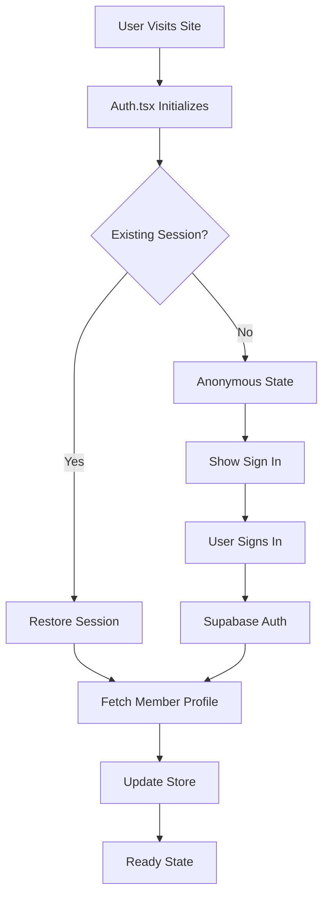

# Authentication Module

This module handles all authentication and authorization functionality for the PGC Tour application.

## 📁 Files Overview

### `Auth.tsx` ✅ **ACTIVE**
**Main authentication provider and React context**

**Purpose:** 
- Provides authentication state and methods to the entire application
- Integrates with Supabase authentication
- Manages member profile data
- Synchronizes auth state with the main store

**Key Features:**
- Session persistence and restoration
- Member profile integration
- Error handling and loading states
- Automatic session refresh

**Usage:**
```tsx
import { useAuth } from "@/src/lib/auth/Auth";

function MyComponent() {
  const { 
    user,           // Supabase User object
    session,        // Supabase Session object
    member,         // PGC Tour Member profile
    isAuthenticated, // Boolean auth status
    isLoading,      // Loading state
    error,          // Error state
    signOut,        // Sign out function
    refreshAuth     // Manual refresh function
  } = useAuth();
  
  // Component logic here
}
```

**Provider Setup:** Already configured in `app/layout.tsx`

### `AuthContext.tsx` ⚠️ **DEPRECATED**
**Legacy authentication context - DO NOT USE**

This file is kept for reference but should not be used in new code. All functionality has been migrated to `Auth.tsx`.

### `AuthStoreService.ts`
**Service layer for auth-store integration**

**Purpose:**
- Provides utility functions for auth-related store operations
- Handles data transformation between auth and store states
- Manages authentication-related side effects

**Key Functions:**
- Member profile synchronization
- Auth state persistence
- Store cleanup on sign out

## 🔧 Integration Points

### With Main Store
The auth module integrates directly with the main Zustand store to:
- Update member information
- Trigger data refresh on authentication changes
- Clear sensitive data on sign out

### With Supabase
- Uses Supabase client for authentication operations
- Handles session management and persistence
- Integrates with Supabase middleware for protected routes

## 🔄 Authentication Flow



## 🛡️ Security Considerations

- All authentication operations use Supabase's secure authentication
- Session tokens are handled securely by Supabase
- Member data is only accessible when authenticated
- Automatic session refresh prevents token expiration issues

## 📋 Migration Notes

If you encounter imports from `AuthContext.tsx`, update them to use `Auth.tsx`:

```tsx
// ❌ Old way (deprecated)
import { useAuth } from "@/src/lib/auth/AuthContext";

// ✅ New way (current)
import { useAuth } from "@/src/lib/auth/Auth";
```

## 🔍 Error Handling

The auth module provides comprehensive error handling:

- **Network errors:** Graceful degradation with retry mechanisms
- **Authentication errors:** Clear error messages for users
- **Session expiry:** Automatic refresh or redirect to sign in
- **Member profile errors:** Fallback to basic user information

## ⚡ Performance Optimizations

- Lazy loading of member profile data
- Efficient session restoration on app startup
- Minimal re-renders through optimized context updates
- Automatic cleanup of event listeners and subscriptions
