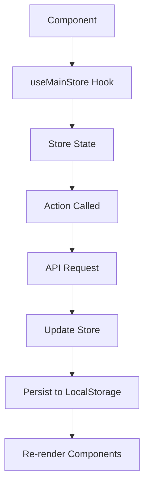

# State Management Module

This module provides centralized state management for the PGC Tour application using Zustand.

## 📁 Files Overview

### Core Store Files

#### `store.ts`
**Main Zustand store definition**

**Purpose:** Central state container for all application data including tournaments, members, standings, and UI state.

**Key State Sections:**
```typescript
interface MainStore {
  // Tournament Data
  currentTournament: Tournament | null;
  leaderboardData: LeaderboardEntry[];
  
  // Member Data  
  members: Member[];
  currentMember: Member | null;
  
  // UI State
  isLoading: boolean;
  lastUpdated: Date | null;
  
  // Actions
  setCurrentTournament: (tournament: Tournament) => void;
  updateLeaderboard: (data: LeaderboardEntry[]) => void;
  // ... more actions
}
```

**Features:**
- Persistent storage via localStorage
- Type-safe state and actions
- Direct integration with authentication
- Optimized selectors for performance

#### `InitStoreWrapper.tsx`
**Store initialization component**

**Purpose:** Wraps the app to handle store initialization and loading states.

**Features:**
- Shows loading spinner during initialization
- Error handling with retry functionality
- Emergency reset capability
- Graceful degradation on failure

**Usage:** Already integrated in `app/layout.tsx`

#### `init.ts` & `mainInit.ts`
**Store initialization logic**

**Purpose:** 
- `init.ts` - Core initialization orchestration
- `mainInit.ts` - Main data fetching and initialization functions

**Key Functions:**
- `initializeStore()` - Main initialization entry point
- `refreshUserData()` - User-specific data refresh
- `loadTournamentData()` - Tournament and leaderboard loading

### Data Management Files

#### `cache.ts`
**Data caching and refresh logic**

**Purpose:** Manages data caching, refresh strategies, and cache invalidation.

**Key Features:**
- Intelligent cache refresh based on data age
- Force refresh capabilities
- Optimized network request patterns
- Background data updates

**Cache Strategies:**
- **Immediate:** Always fetch fresh data
- **Smart:** Fetch only if data is stale
- **Background:** Update cache without blocking UI

#### `cacheInvalidation.ts`
**Cache invalidation strategies**

**Purpose:** Defines when and how cached data should be invalidated.

**Invalidation Triggers:**
- User authentication changes
- Tournament state transitions
- Manual refresh requests
- Time-based expiration

#### `leaderboard.ts`
**Leaderboard-specific state management**

**Purpose:** Specialized logic for leaderboard data handling.

**Features:**
- Real-time leaderboard updates
- Sorting and filtering logic
- Position change tracking
- Performance optimizations for large datasets

#### `transitions.ts`
**Tournament state transitions**

**Purpose:** Manages complex tournament state changes and their side effects.

**State Machine:**
```
Draft → Active → Completed → Archived
```

**Features:**
- Validates state transitions
- Handles data updates during transitions
- Triggers necessary cache invalidations
- Manages UI state during transitions

### Utility Files

#### `storeUtils.ts`
**Store utility functions**

**Purpose:** Common utility functions for store operations.

**Functions:**
- Data transformation helpers
- State validation utilities
- Performance optimization helpers
- Debug utilities

## 🏗️ Architecture Overview

### Single Store Pattern
The application uses a single main store that contains all global state:

```typescript
const useMainStore = create<MainStore>()(
  persist(
    (set, get) => ({
      // State
      currentTournament: null,
      members: [],
      isLoading: false,
      
      // Actions
      setCurrentTournament: (tournament) => 
        set({ currentTournament: tournament }),
      
      // Complex actions with side effects
      refreshTournamentData: async () => {
        set({ isLoading: true });
        try {
          const data = await fetchTournamentData();
          set({ 
            currentTournament: data.tournament,
            leaderboardData: data.leaderboard,
            isLoading: false 
          });
        } catch (error) {
          set({ isLoading: false, error });
        }
      }
    }),
    {
      name: 'pgc-tour-store',
      storage: createJSONStorage(() => localStorage),
      partialize: (state) => ({ 
        // Only persist essential data
        currentTournament: state.currentTournament,
        members: state.members,
        lastUpdated: state.lastUpdated
      })
    }
  )
);
```

### Integration with Authentication

The store integrates directly with the authentication system:

```typescript
// Auth changes trigger store updates
const { member } = useAuth();
const { updateCurrentMember } = useMainStore();

useEffect(() => {
  if (member) {
    updateCurrentMember(member);
  }
}, [member, updateCurrentMember]);
```

## 🔄 Data Flow



## 🚀 Usage Examples

### Basic State Access
```typescript
import { useMainStore } from "@/src/lib/store/store";

function TournamentDisplay() {
  const { currentTournament, isLoading } = useMainStore();
  
  if (isLoading) return <LoadingSpinner />;
  if (!currentTournament) return <NoTournament />;
  
  return <div>{currentTournament.name}</div>;
}
```

### State Updates
```typescript
function TournamentControls() {
  const { setCurrentTournament, refreshTournamentData } = useMainStore();
  
  const handleRefresh = async () => {
    await refreshTournamentData();
  };
  
  return (
    <button onClick={handleRefresh}>
      Refresh Data
    </button>
  );
}
```

### Optimized Selectors
```typescript
// Only re-render when leaderboard changes
const leaderboard = useMainStore(state => state.leaderboardData);

// Only re-render when loading state changes
const isLoading = useMainStore(state => state.isLoading);
```

## ⚡ Performance Optimizations

1. **Selective Subscriptions:** Components only subscribe to needed state slices
2. **Persistent Storage:** Essential data survives page reloads
3. **Background Updates:** Data refreshes without blocking UI
4. **Optimized Serialization:** Only essential data is persisted
5. **Debounced Updates:** Rapid state changes are batched

## 🛠️ Debug Features

### Development Tools
- Store state inspection via browser dev tools
- Action logging in development mode
- Performance monitoring for state updates
- Cache hit/miss tracking

### Emergency Reset
The `InitStoreWrapper` provides an emergency reset button for development:
- Clears all persisted state
- Reinitializes store to default values
- Useful for testing and debugging

## 📋 Best Practices

### Do's ✅
- Use selective subscriptions to minimize re-renders
- Keep actions simple and focused
- Use the provided hooks for store access
- Handle loading and error states appropriately

### Don'ts ❌
- Don't mutate store state directly
- Don't store sensitive data in persisted state
- Don't create multiple store instances
- Don't bypass the provided abstractions

## 🔧 Maintenance

### Adding New State
1. Update the store interface in `store.ts`
2. Add corresponding actions
3. Update persistence configuration if needed
4. Add initialization logic in `mainInit.ts`

### Cache Management
- Monitor cache hit rates in development
- Adjust cache expiration times based on data freshness needs
- Use invalidation strategies appropriate for each data type
