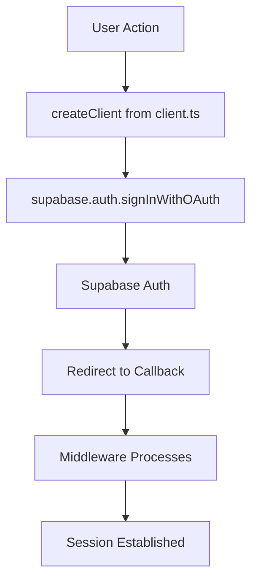
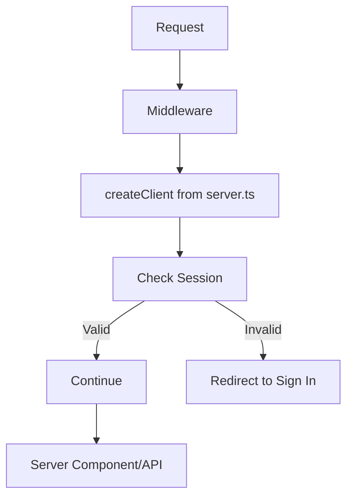

# Supabase Integration Module

This module provides Supabase client configurations and middleware for database operations and authentication.

## 📁 Files Overview

### `client.ts`
**Client-side Supabase client**

**Purpose:** Provides the Supabase client for browser/client-side operations.

**Features:**
```typescript
import { createBrowserClient } from '@supabase/ssr';

export const createClient = () => {
  return createBrowserClient(
    process.env.NEXT_PUBLIC_SUPABASE_URL!,
    process.env.NEXT_PUBLIC_SUPABASE_ANON_KEY!
  );
};
```

**Usage:**
```typescript
import { createClient } from "@/src/lib/supabase/client";

function ClientComponent() {
  const supabase = createClient();
  
  const handleSignIn = async () => {
    await supabase.auth.signInWithOAuth({
      provider: 'google'
    });
  };
  
  return <button onClick={handleSignIn}>Sign In</button>;
}
```

**Use Cases:**
- Authentication operations in React components
- Real-time subscriptions
- Client-side database queries
- File uploads and storage operations

### `server.ts`
**Server-side Supabase client**

**Purpose:** Provides the Supabase client for server-side operations (API routes, server components).

**Features:**
```typescript
import { createServerClient } from '@supabase/ssr';
import { cookies } from 'next/headers';

export const createClient = () => {
  const cookieStore = cookies();
  
  return createServerClient(
    process.env.NEXT_PUBLIC_SUPABASE_URL!,
    process.env.NEXT_PUBLIC_SUPABASE_ANON_KEY!,
    {
      cookies: {
        get(name: string) {
          return cookieStore.get(name)?.value;
        },
        set(name: string, value: string, options: CookieOptions) {
          cookieStore.set({ name, value, ...options });
        },
        remove(name: string, options: CookieOptions) {
          cookieStore.set({ name, value: '', ...options });
        },
      },
    }
  );
};
```

**Usage:**
```typescript
import { createClient } from "@/src/lib/supabase/server";

// In API routes
export async function GET() {
  const supabase = createClient();
  const { data, error } = await supabase
    .from('tournaments')
    .select('*');
    
  return Response.json({ data, error });
}

// In Server Components
export default async function ServerComponent() {
  const supabase = createClient();
  const { data: tournaments } = await supabase
    .from('tournaments')
    .select('*');
    
  return <TournamentList tournaments={tournaments} />;
}
```

**Use Cases:**
- API route handlers
- Server components data fetching
- Middleware operations
- Server-side authentication checks

### `middleware.ts`
**Authentication middleware**

**Purpose:** Handles authentication and authorization at the middleware level.

**Key Features:**
```typescript
export async function updateSession(request: NextRequest) {
  let response = NextResponse.next({
    request: {
      headers: request.headers,
    },
  });

  const supabase = createServerClient(
    process.env.NEXT_PUBLIC_SUPABASE_URL!,
    process.env.NEXT_PUBLIC_SUPABASE_ANON_KEY!,
    {
      cookies: {
        get(name: string) {
          return request.cookies.get(name)?.value;
        },
        set(name: string, value: string, options: CookieOptions) {
          request.cookies.set({
            name,
            value,
            ...options,
          });
          response = NextResponse.next({
            request: {
              headers: request.headers,
            },
          });
          response.cookies.set({
            name,
            value,
            ...options,
          });
        },
        remove(name: string, options: CookieOptions) {
          request.cookies.set({
            name,
            value: '',
            ...options,
          });
          response = NextResponse.next({
            request: {
              headers: request.headers,
            },
          });
          response.cookies.set({
            name,
            value: '',
            ...options,
          });
        },
      },
    }
  );

  await supabase.auth.getUser();
  return response;
}
```

**Protected Routes:**
- `/admin/*` - Admin only access
- `/profile/*` - Authenticated users only
- Automatic session refresh
- Cookie management for SSR

**Integration:** Used in `/src/middleware.ts` at the root level

## 🔧 Configuration

### Environment Variables
Required environment variables for Supabase integration:

```env
# Required
NEXT_PUBLIC_SUPABASE_URL=your_supabase_url
NEXT_PUBLIC_SUPABASE_ANON_KEY=your_supabase_anon_key

# Optional (for service role operations)
SUPABASE_SERVICE_ROLE_KEY=your_service_role_key
```

### Database Schema Integration
The Supabase clients work with Prisma schema types:

```typescript
// Types are automatically inferred from Prisma
import type { Member, Tournament } from '@prisma/client';

const supabase = createClient();
const { data }: { data: Tournament[] } = await supabase
  .from('tournaments')
  .select('*');
```

## 🔄 Authentication Flow

### Client-Side Authentication


### Server-Side Session Handling


## 📋 Usage Patterns

### Real-time Subscriptions
```typescript
import { createClient } from "@/src/lib/supabase/client";

function useRealtimeLeaderboard() {
  const [leaderboard, setLeaderboard] = useState([]);
  const supabase = createClient();
  
  useEffect(() => {
    const subscription = supabase
      .channel('leaderboard-changes')
      .on('postgres_changes', 
        { 
          event: '*', 
          schema: 'public', 
          table: 'leaderboard' 
        },
        (payload) => {
          // Handle real-time updates
          setLeaderboard(current => updateLeaderboard(current, payload));
        }
      )
      .subscribe();
      
    return () => subscription.unsubscribe();
  }, []);
  
  return leaderboard;
}
```

### File Storage Operations
```typescript
import { createClient } from "@/src/lib/supabase/client";

async function uploadProfileImage(file: File, userId: string) {
  const supabase = createClient();
  
  const { data, error } = await supabase.storage
    .from('avatars')
    .upload(`${userId}/profile.jpg`, file, {
      cacheControl: '3600',
      upsert: true
    });
    
  if (error) throw error;
  return data;
}
```

### Database Operations with RLS
```typescript
import { createClient } from "@/src/lib/supabase/server";

// Server-side with Row Level Security
export async function getUserTournaments(userId: string) {
  const supabase = createClient();
  
  // RLS automatically filters based on authenticated user
  const { data, error } = await supabase
    .from('user_tournaments')
    .select(`
      *,
      tournament:tournaments(*)
    `)
    .eq('user_id', userId);
    
  return { data, error };
}
```

## 🛡️ Security Considerations

### Row Level Security (RLS)
All database tables should have RLS policies:

```sql
-- Enable RLS on tournaments table
ALTER TABLE tournaments ENABLE ROW LEVEL SECURITY;

-- Policy for authenticated users
CREATE POLICY "Users can view tournaments" 
ON tournaments FOR SELECT 
TO authenticated 
USING (true);

-- Policy for admin operations
CREATE POLICY "Admins can manage tournaments" 
ON tournaments FOR ALL 
TO authenticated 
USING (
  EXISTS (
    SELECT 1 FROM members 
    WHERE members.user_id = auth.uid() 
    AND members.is_admin = true
  )
);
```

### API Security
```typescript
// Always verify user in API routes
import { createClient } from "@/src/lib/supabase/server";

export async function POST(request: Request) {
  const supabase = createClient();
  
  const { data: { user }, error } = await supabase.auth.getUser();
  
  if (error || !user) {
    return Response.json({ error: 'Unauthorized' }, { status: 401 });
  }
  
  // Proceed with authenticated operation
}
```

## 🔧 Troubleshooting

### Common Issues

1. **Session Not Persisting**
   - Ensure middleware is properly configured
   - Check cookie settings in browser
   - Verify environment variables

2. **RLS Blocking Queries**
   - Check RLS policies are correctly configured
   - Verify user authentication state
   - Use service role key for admin operations

3. **CORS Issues**
   - Configure allowed origins in Supabase dashboard
   - Ensure proper headers in API routes

### Debug Utilities
```typescript
// Debug authentication state
import { createClient } from "@/src/lib/supabase/client";

export function useAuthDebug() {
  const supabase = createClient();
  
  useEffect(() => {
    supabase.auth.onAuthStateChange((event, session) => {
      console.log('Auth event:', event);
      console.log('Session:', session);
    });
  }, []);
}
```

## 📊 Performance Optimization

### Connection Pooling
Supabase automatically handles connection pooling, but consider:
- Using connection strings with pooling enabled
- Implementing query result caching
- Batching multiple operations

### Query Optimization
```typescript
// ✅ Good - Selective fields
const { data } = await supabase
  .from('tournaments')
  .select('id, name, start_date')
  .limit(10);

// ❌ Avoid - Selecting all fields when unnecessary
const { data } = await supabase
  .from('tournaments')
  .select('*');
```

### Real-time Subscription Management
```typescript
// ✅ Good - Cleanup subscriptions
useEffect(() => {
  const subscription = supabase.channel('changes').subscribe();
  return () => subscription.unsubscribe();
}, []);

// ❌ Avoid - Memory leaks from uncleaned subscriptions
useEffect(() => {
  supabase.channel('changes').subscribe();
  // Missing cleanup
}, []);
```
